# REDISEÑO DE WEBPAGE KMIMOS
Kmimos es un proyecto de rediseño web dónde detectamos áreas de mejora en usabilidad, diseño de interacción y arquitectura de la información, ofreciendo una propuesta desde el UX Design que cubra tanto las necesidades del usuario como los objetivos de negocio.

#### Desarrollado para [Laboratoria](https://laboratroria.la)

## Objetivos 
* Generar más leads y conversiones aprovechando la reciente alianza con Petco 
* Aumentar el número de conversiones en sus servicios, sobre todo Paseos y Hospedaje 
* Mejorar la usabilidad de su sitio web 

## Pruebas de usabilidad

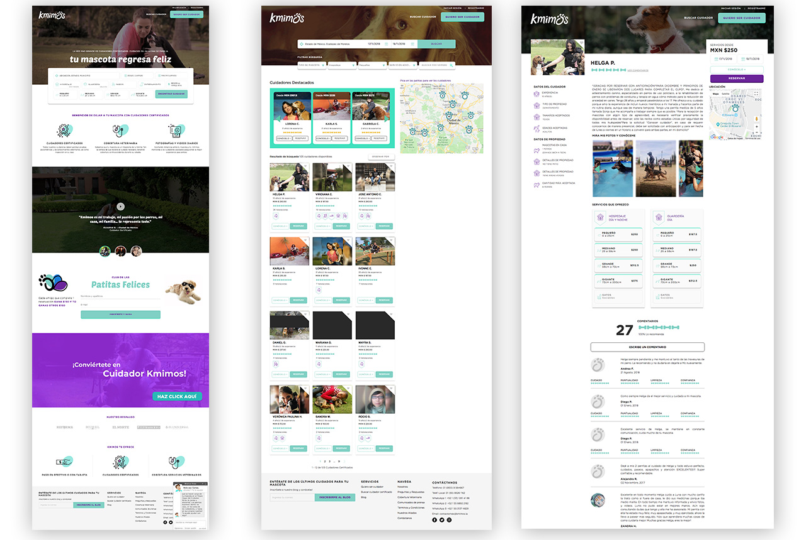

Se realizaron pruebas de usabilidad tanto en computadoras de escritorio como en móviles, detectamos frustración, desconfianza, confusión e inseguridad por parte de los usuario.

* Usuarios no tienen tan claro el tipo de servicio que ofrece Kmimos, sobre todo cuando son nuevos 
* Se confunden, ya que se les menciona que reservan en "3 simples pasos" y ellos perciben más 
* Al querer "Reservar" se le da mucha prioridad a los datos del cuidador y la acción no se encuentra visible 
* Dentro de los datos del cuidador hay información confusa "31 años de experiencia" "Cuidadores certificados"

[Pruebas de usabilidad](https://docs.google.com/document/d/15r4QFZYO9iFd6MLCkyq9cmMDicD-56N1dj7zV_06M_U/edit?usp=sharing)

## Investigación de campo

### Visita a Tiendas y Entrevistas
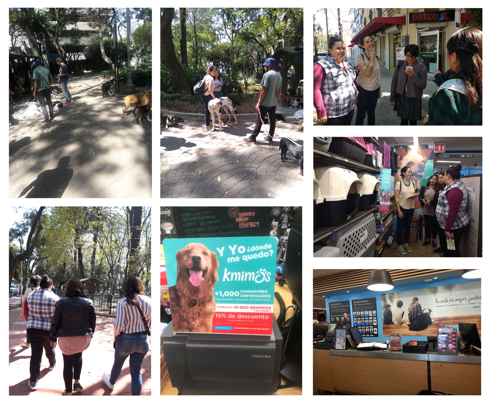
[Ver Documentación](https://drive.google.com/drive/folders/11LvCLBJE9hpK95pSDcyWa5FVuzY8zFyu)

* Las personas que contratan los servicios de "Hospedaje" y "Paseos" son de clase alta, de 25 a 35 años y en su mayoría mujeres
* Contratan estos servicios si el lugar o la reputación del cuidador las da "confianza"
* Quieren que sus perros sean tratados y consentidos como en casa 
* Dentro de las tiendas desconocen la alianza con Kmimos y no saben a detalle los servicios que ofrecen 
* Sólo cuentan con un miniposter que tiene  información de contacto y brindan más detalles estrictamente en el caso de que el cliente pregunte

### Encuestas
[Ver Resultados](https://drive.google.com/open?id=1O7M3DQ3wyvxIqrCDO2gstVlrIXMjX3P1)
* El 69% son mujeres en su mayoría solteras
* Cuidan a su mascota como un miembro más de su familia 
* Buscan opciones que les de confianza 
* Esperan que los cuidadores sean profesionales 

## Journey map

## User persona
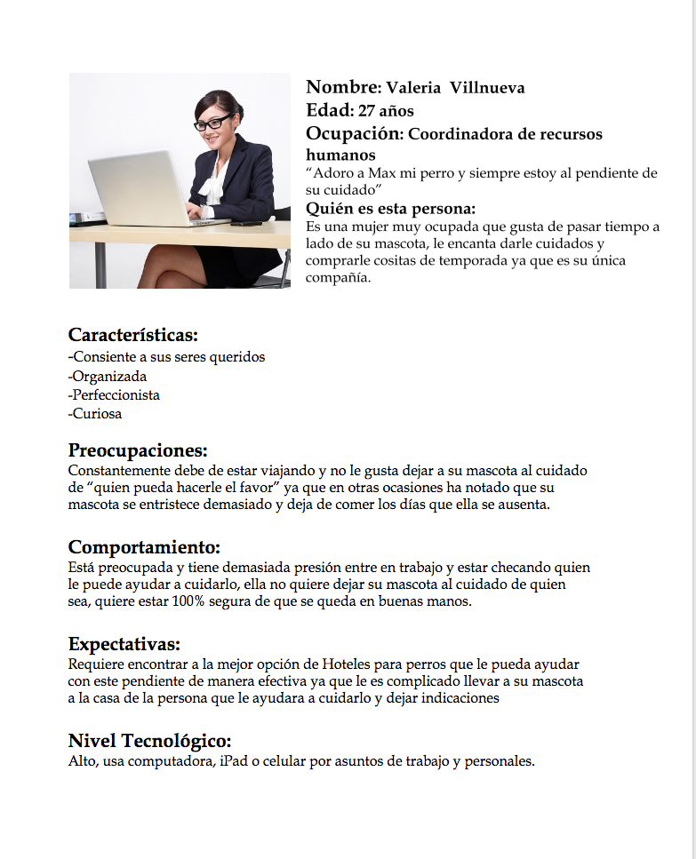
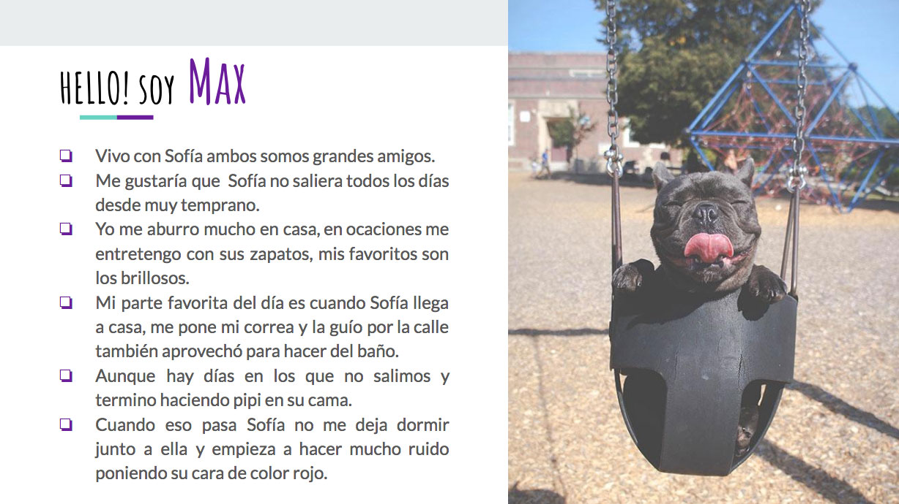

## Empathy maps

## Insights
* Su mascota es parte de su familia
* Son 100% responsables de su cuidado
* Cuando salen de viaje se preocupan por dejarlo en buenas manos
* Se preocupan por su seguridad, libertad y entretenimiento
* Deben sentir mucha confianza en la persona que cuidará a su perro
* Confía por que son expertos en cuidados caninos
* Monitoreo, Saber cómo está en cada momento 
* Buen trato hacia ellos como dueños

## Propuestas de Solución Rediseño Web
Después del análisis e investigación proponemos realizar algunos cambios para hacer más claro el mensaje que Kmimos quiere transmitir a los nuevos usuarios, principalmente a los que obtiene de la alianza con Petco, por lo cual proponemos:

* Hacer una página o landing page que indique la alianza entre Petco y Kmimos
* Mejorar la Arquitectura de la información 
* Detallar los servicios y a que se dedica Kmimos
* Mejorar el form inicial para personalizar servicios solicitados de acuerdo a sus necesidades 

[Primera presentación](https://docs.google.com/presentation/d/18bBW1uNSuBmjsn9aYBqwkG146GzX3qhzd2xTpEBou9M/edit#slide=id.g46e222315e_0_20)

### Primer alcance
Para nuestra primer alcance proponemos mejorar la usabilidad del formulario de reserva de servicio en Kmimos

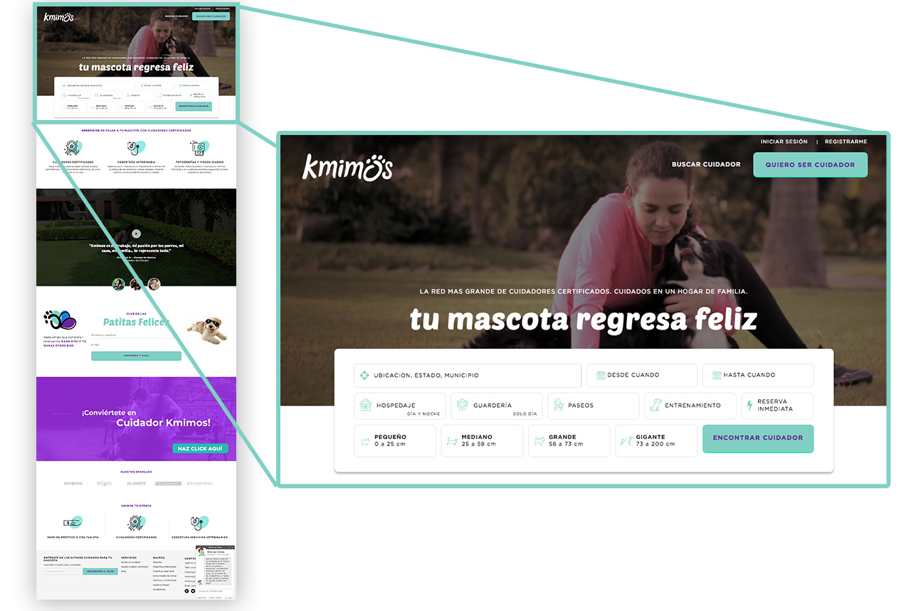

#### Beneficio:
Optimizar el formulario lo más posible logrará cumplir el objetivo de negocio que es la venta de un servicio, al mismo tiempo que se cumple el objetivo del usuario reservar un servicio.

#### Objetivo del usuario:
Quiere reservar el hospedaje, guardería, paseo o adiestramiento para su perro en una fecha específica

#### Estrategia a implementar:
* Recopilar los datos estrictamente necesarios del usuario
* Facilitar el registro haciendo que el usuario no pierda la paciencia
* Eliminar el campo INE
* Evitar obstáculos que impidan que los usuarios nuevos desistan de realizar una reserva o registrarse

### Ajustes adicionales 
Para ayudar a transmitir el mensaje de Kmimos de una manera más clara y organizada proponemos hacer incapié sobre los beneficios de dejar a su mascota con cuidadores certificados de Kmimos, reestructurando la página inicial de Kmimos

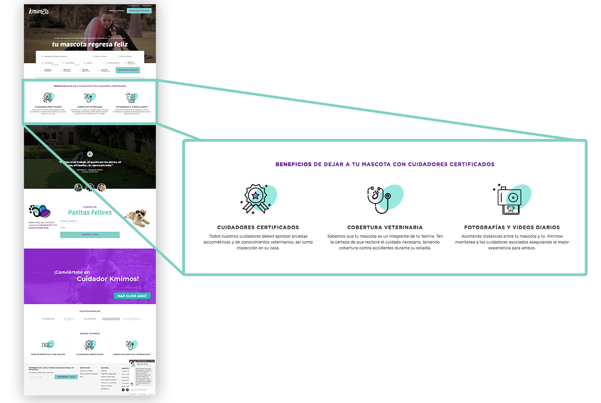

## Sketches Pantalla de inicio y formulario de reserva

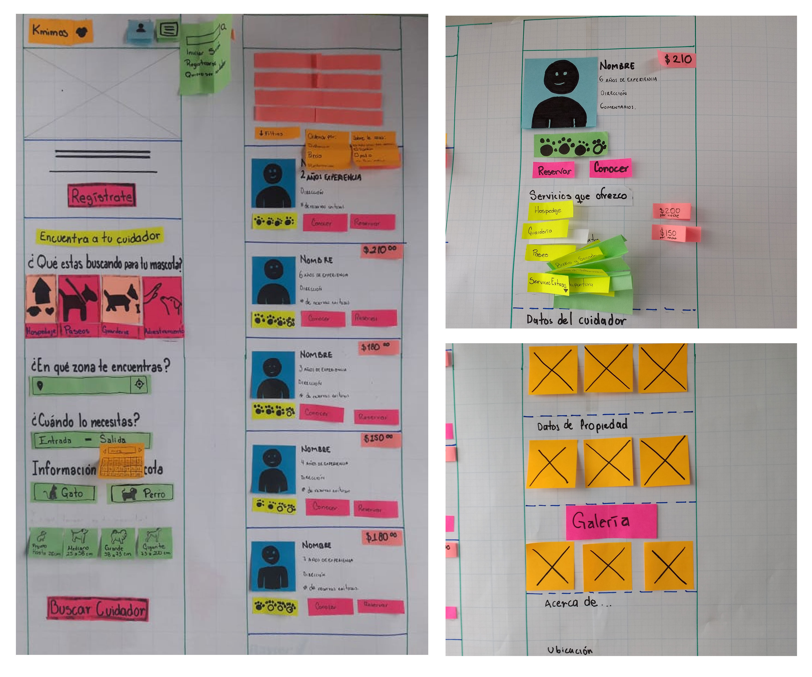

## Testing de flujo

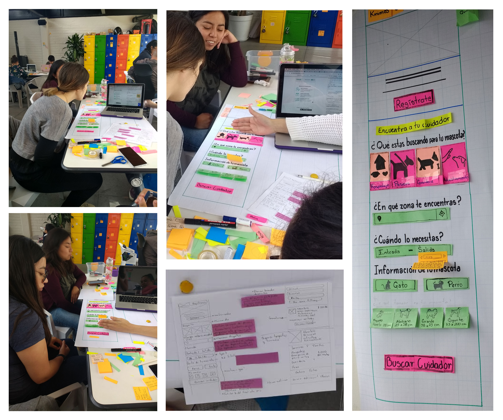

## Wireframes

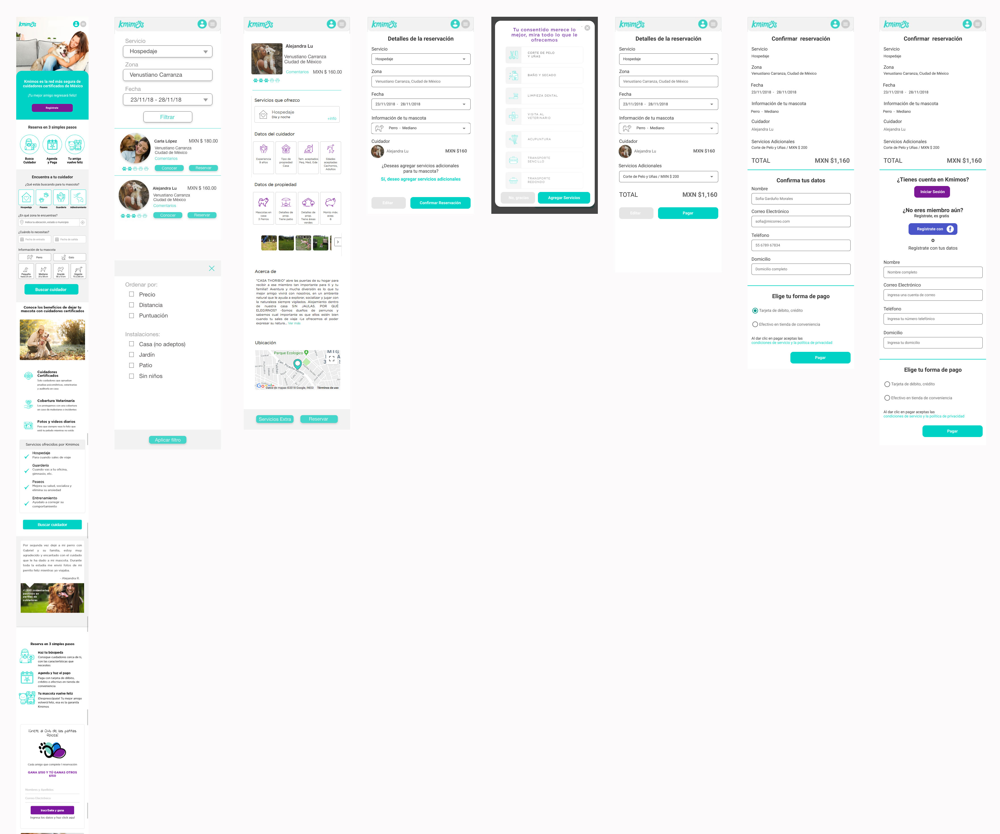

## Prototipo
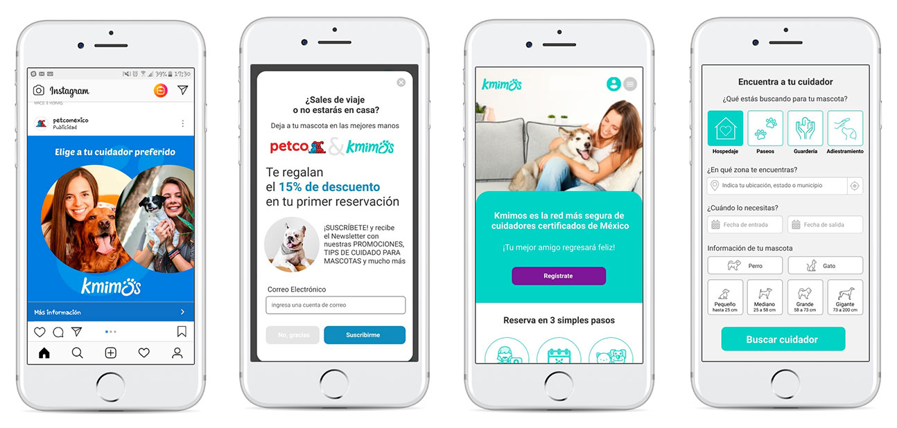

[prototipo](https://marvelapp.com/394ji52/screen/50379920)

## Recomendaciones Futuras
* Incluir links a notas de medios que estan hablando de Kmimos para dar mayor confianza a usuarios nuevos
* Definir los pasos de reserva para dar más claridad y que no queden vacios en las instrucciones
* Agregar información a las secciones que no tienen 
* Mejorar la visualización de testimonios
* Rediseñar el copy y estructura de sección Club Patitas para ser más claros en los beneficios de referir a amigos

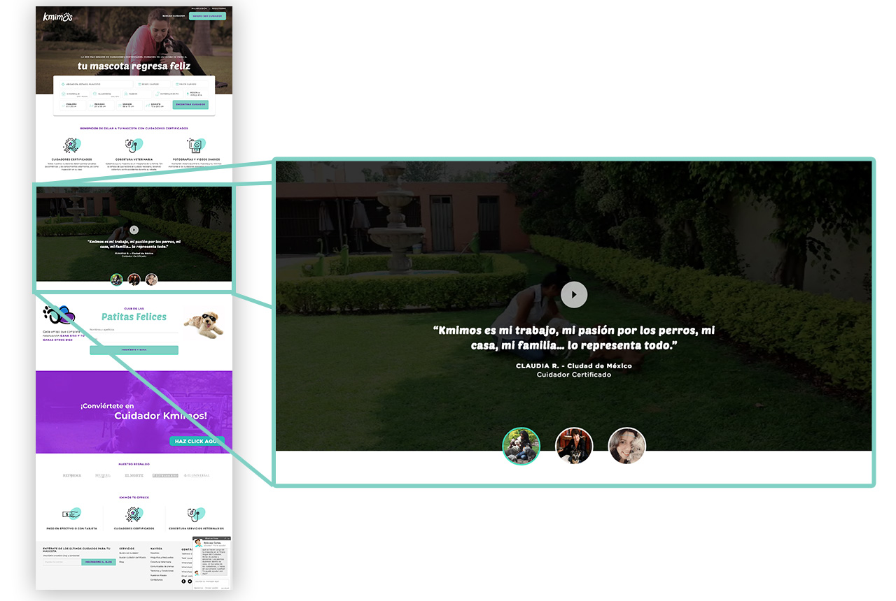

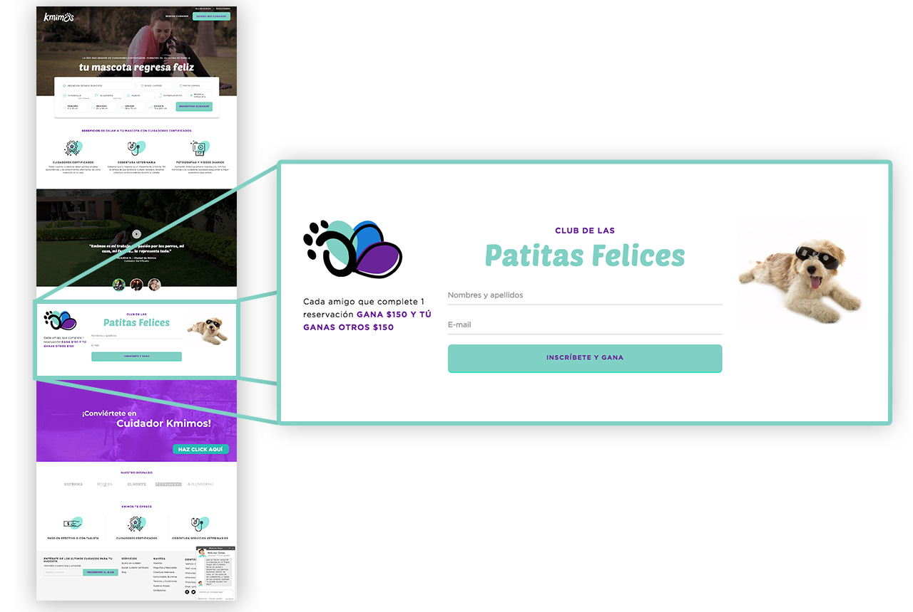

[Segunda presentación](https://docs.google.com/presentation/d/17SlExZ-5Bzn6TdT208-M6oYMgNEPaUqaPpYZbTcOpRc/edit#slide=id.g4706c582d3_4_163)

