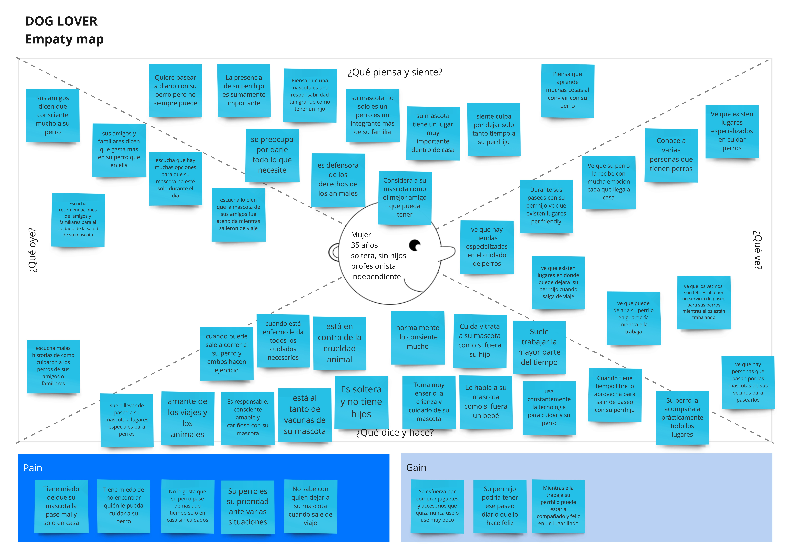
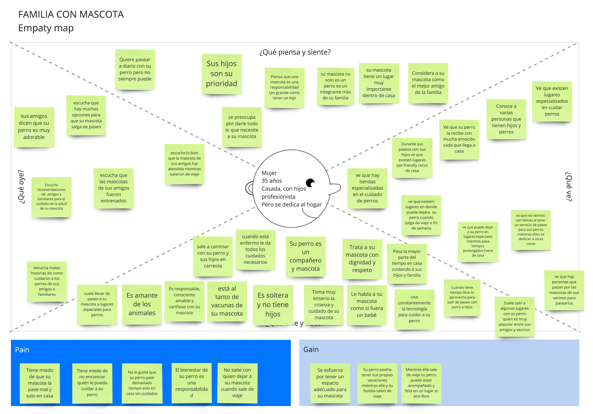
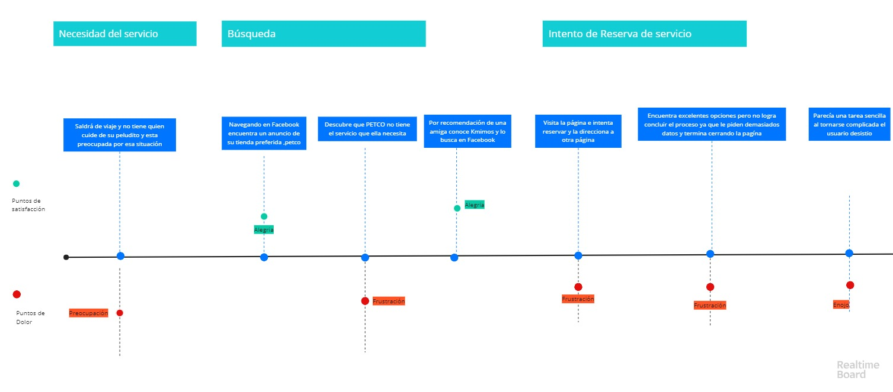

# REDISEÑO DE WEBPAGE KMIMOS
Kmimos es un proyecto de rediseño web dónde detectamos áreas de mejora en usabilidad, diseño de interacción y arquitectura de la información, ofreciendo una propuesta desde el UX Design que cubra tanto las necesidades del usuario como los objetivos de negocio.

#### Desarrollado para [Laboratoria](https://laboratroria.la)

## Objetivos 
* Generar más leads y conversiones aprovechando la reciente alianza con Petco 
* Aumentar el número de conversiones en sus servicios, sobre todo Paseos y Hospedaje 
* Mejorar la usabilidad de su sitio web 

## Pruebas de usabilidad
* Usuarios no tienen tan claro el tipo de servicio que ofrece Kmimos, sobre todo cuando son nuevos 
* Se confunden, ya que se les menciona que reservan en "3 simples pasos" y ellos perciben más 
* Al querer "Reservar" se le da mucha prioridad a los datos del cuidador y la acción no se encuentra visible 
* Dentro de los datos del cuidador hay información confusa "31 años de experiencia" "Cuidadores certificados"
[pruebas de usabilidad](https://docs.google.com/document/d/15r4QFZYO9iFd6MLCkyq9cmMDicD-56N1dj7zV_06M_U/edit?usp=sharing)

## Investigación de campo

### Visita a Tiendas y Entrevistas
[Ver Documentación](https://drive.google.com/drive/folders/11LvCLBJE9hpK95pSDcyWa5FVuzY8zFyu)

* Las personas que contratan los servicios de "Hospedaje" y "Paseos" son de clase alta, de 25 a 35 años y en su mayoría mujeres
* Contratan estos servicios si el lugar o la reputación del cuidador las da "confianza"
* Quieren que sus perros sean tratados y consentidos como en casa 
* Dentro de las tiendas desconocen la alianza con Kmimos y no saben a detalle los servicios que ofrecen 
* Sólo cuentan con un miniposter que tiene  información de contacto y brindan más detalles estrictamente en el caso de que el cliente pregunte

### Encuestas
[Ver Resultados](https://drive.google.com/open?id=1O7M3DQ3wyvxIqrCDO2gstVlrIXMjX3P1)
* El 69% son mujeres en su mayoría solteras
* Cuidan a su mascota como un miembro más de su familia 
* Buscan opciones que les de confianza 
* Esperan que los cuidadores sean profesionales 

## User persona

## Empathy maps

## Journey map

[Primera presentación](https://docs.google.com/presentation/d/18bBW1uNSuBmjsn9aYBqwkG146GzX3qhzd2xTpEBou9M/edit#slide=id.g46e222315e_0_20)

[Segunda presentación](https://docs.google.com/presentation/d/17SlExZ-5Bzn6TdT208-M6oYMgNEPaUqaPpYZbTcOpRc/edit#slide=id.g4706c582d3_4_163)

## Prototipo
Hacer una página o landing page que indique la alianza entre  Petco   y   Kmimos
Arquitectura de la información 
Detallar los servicios y a que se dedica Kmimos
Mejorar el form inicial para personalizar servicios solicitados de acuerdo a sus necesidades 
[prototipo](https://marvelapp.com/394ji52/screen/50379920)